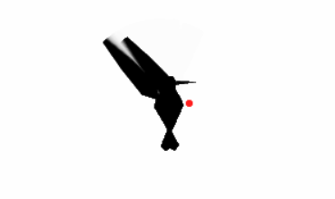

# HumSim

A browser-based application featuring a realistic hummingbird that follows the user's mouse cursor with authentic flight physics and wing animation.

<div align="center">
  
</div>

## Overview

HumSim is an interactive polygonal hummingbird simulation that demonstrates realistic flight behavior through geometric minimalism. The application features a pure black hummingbird composed of independent polygonal parts (hexagonal body, triangular wings, head, and tail) that move independently to create dynamic, articulated flight behavior.

## Key Features

### Realistic Flight Physics
- **Hover-Dart-Hover Pattern**: Authentic hummingbird movement with smooth acceleration and precise stops
- **Speed-Based Body Orientation**: Bird tilts from upright hover to horizontal flight based on velocity
- **Independent Part Animation**: Each polygonal component moves separately for natural articulation

### Geometric Design Philosophy
- **Polygonal Architecture**: All shapes are mathematical polygons with sharp vertices (no curves)
- **Pure Black Aesthetic**: `#000000` on `#FFFFFF` background for maximum contrast
- **Modern Tech Style**: Apple/Tesla inspired minimalism with mathematical precision
- **Flat Design**: No gradients, shadows, or decorative elements

### Performance & Effects
- **60 FPS Target**: Smooth animation with frame rate monitoring and fallback strategies
- **Motion Blur**: Sophisticated canvas trail technique for wing blur effects
- **Responsive Design**: Fullscreen canvas that adapts to any screen size
- **Browser Optimized**: Single HTML file with minimal dependencies

## Quick Start

### Local Development
1. Open `index.html` in a modern web browser
2. Move your mouse to see the hummingbird follow with realistic flight behavior
3. Observe the hover-dart-hover movement pattern and wing speed variations

### Docker Deployment
Run HumSim in a containerized environment using Docker:

```bash
# Using Docker Compose (recommended)
docker-compose up -d

# Or build and run manually
docker build -t humsim .
docker run -p 8080:80 humsim
```

Access the application at `http://localhost:8080`

**Docker Features:**
- Nginx-based static file serving
- Production-ready container
- Automatic restart policies
- Port mapping (8080:80)

## Technical Implementation

### Architecture
- **Graphics Engine**: HTML5 Canvas API (2D rendering)
- **Animation Framework**: Anime.js for smooth hover-dart-hover easing
- **Physics System**: Custom JavaScript for hummingbird-specific flight behavior
- **Input System**: Real-time mouse tracking with coordinate mapping

### Key Components
- **Animation Loop**: Unified 60 FPS `requestAnimationFrame` loop
- **State Management**: Simple object-based tracking for all bird components
- **Motion Blur**: Semi-transparent overlay technique (`rgba(255, 255, 255, 0.15)`)
- **Responsive Scaling**: Mathematical scaling maintains proportions across screen sizes

### Performance Features
- **Frame Rate Monitoring**: Real-time FPS tracking with automatic optimization
- **Memory Efficient**: Minimal object creation, reusable animation instances
- **Graceful Degradation**: Performance fallbacks maintain functionality

## Visual Specifications

### Hummingbird Anatomy
- **Body**: Hexagonal/diamond polygon (20×30px base, scaled responsively)
- **Wings**: Triangular polygons (15×25px base) with independent beat cycles
- **Head**: Small triangular polygon (8×12px) that rotates toward movement
- **Tail**: Triangular polygon (6×10px) that adjusts for flight dynamics

### Animation Details
- **Wing Frequencies**: 40 BPM (hover) → 120 BPM (flight) with smooth transitions
- **Body Tilt Formula**: `speed * 0.02` (upright hover → horizontal flight)
- **Movement Duration**: 1000ms with `easeOutQuart` curve
- **Motion Thresholds**: 20px minimum movement, 8px hover detection

## Browser Compatibility

### Supported Browsers
- Chrome 90+
- Firefox 88+
- Safari 14+
- Edge 90+

### Requirements
- HTML5 Canvas 2D API support
- Modern JavaScript (ES6+)
- Anime.js (loaded via CDN)

## Development

### File Structure
```
humsim/
├── index.html          # Complete application (single file)
├── docs/               # Comprehensive technical documentation
│   ├── 00-prd.md       # Product Requirements Document
│   ├── 01-technical-architecture.md
│   ├── 02-implementation-specification.md
│   ├── 03-implementation-plan.md
│   └── 04-implementation-strategy.md
└── README.md           # This file
```

### Implementation Approach
- **Single File Application**: No build process, all code embedded in `index.html`
- **Zero Configuration**: Works offline after initial CDN load
- **Incremental Development**: Built in phases with continuous testing
- **Performance First**: Optimized for smooth 60 FPS performance

## Documentation

The `docs/` directory contains comprehensive technical documentation:

- **Product Requirements**: Complete feature specifications and success criteria
- **Technical Architecture**: System design decisions and data flow
- **Implementation Specification**: Exact formulas, dimensions, and parameters
- **Implementation Plan**: Step-by-step development phases
- **Implementation Strategy**: Detailed coding approach and best practices

## Design Philosophy

HumSim embodies geometric minimalism with mathematical precision:

> **"Polygonal architecture with dynamic articulation"**

- Each shape is a precise mathematical polygon
- No curves, gradients, or decorative elements
- Independent part movement creates natural flight behavior
- Modern aesthetic inspired by contemporary tech design
- Pure contrast (black on white) for timeless appeal

## Performance Targets

- **Frame Rate**: Consistent 60 FPS across target browsers
- **Responsiveness**: <16ms input latency for immediate mouse response
- **Memory**: Stable usage with no leaks during extended use
- **Compatibility**: Broad browser support with graceful degradation

## License

This project is licensed under the MIT License - see the [LICENSE](LICENSE) file for details.

---

*Move your mouse and watch the geometric hummingbird come to life with authentic flight physics!*